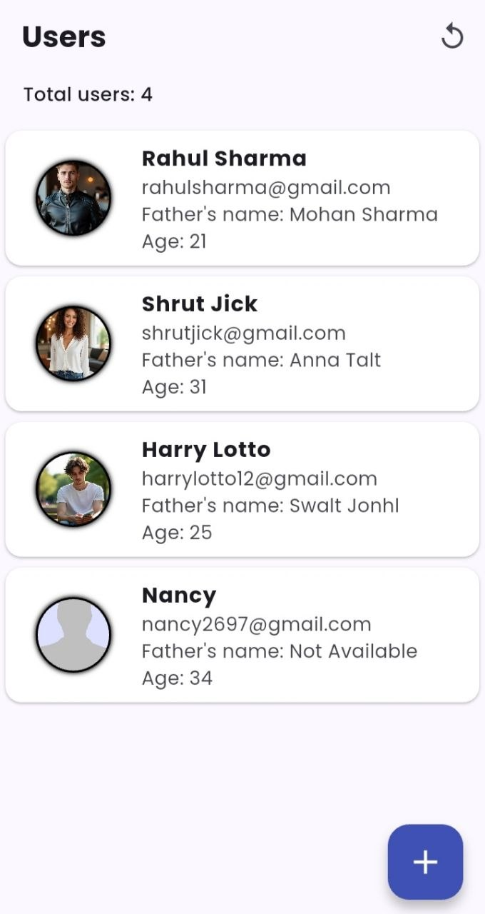
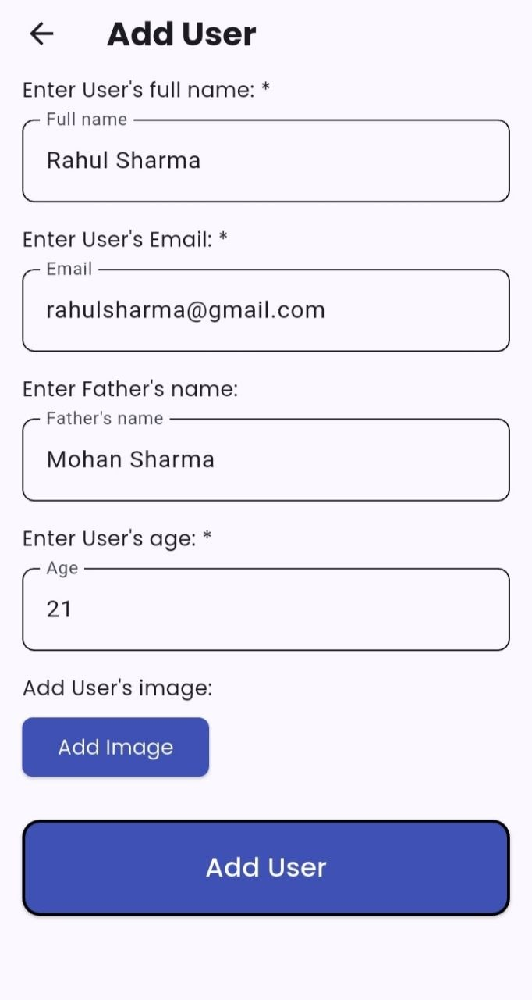

# User Management App

A Flutter practice project for learning REST API integration.

## Features
- View, add, edit, and delete users
- Image upload via Cloudinary
- Built with Provider for state management

## Tech Stack
- Flutter
- REST API (MockAPI)
- Cloudinary (image upload)
- Provider

## Packages Used
- http
- provider
- image_picker
- flutter_dotenv
- google_fonts
- modal_progress_hud_nsn

## Screenshots

## Notes
- This is a learning project built to practice REST API integration in Flutter
